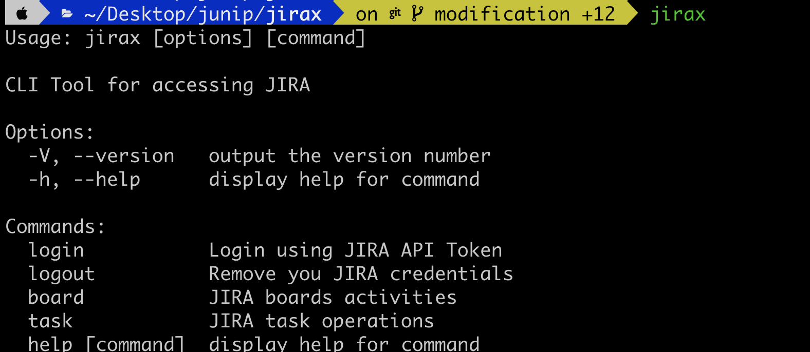
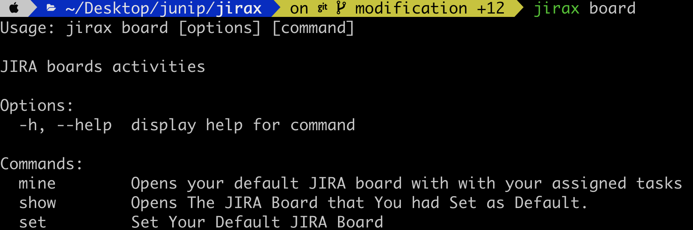
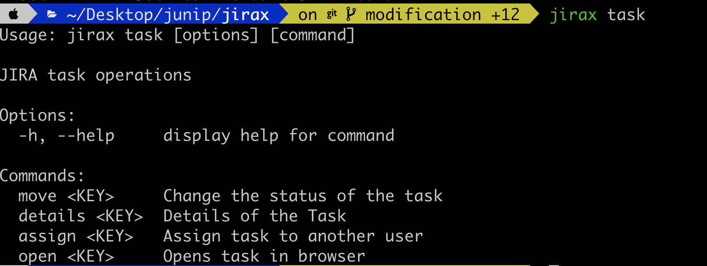
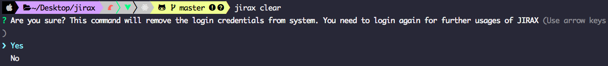

# jirax
[]() []() []() [](https://forthebadge.com)


[](https://dev.azure.com/junipd2/jirax/_build/latest?definitionId=4&branchName=master)    [](https://github.com/prettier/prettier) [](LICENSE) [](http://makeapullrequest.com)

```
```

> :star: If you are using this tool or you like it, Star on GitHub — it helps!


A CLI tool for [JIRA](`https://www.atlassian.com/software/jira`) for day to day usage with JIRA.Speed up your JIRA activity with this CLI tool.


## Prerequisites

You are required to have [Node.js](https://nodejs.org/) installed to run the cli tool or after installing [Node.js](https://nodejs.org/) you can make executable and run the excutable to use the tool. [Make executable](#making-executable)

## Getting Started

1. Log in to [Atlassian](https://id.atlassian.com/manage/api-tokens) and generate your API TOKEN.
2. Copy the API TOKEN
 
## Install Using NPM

You can use directly install the package using 
[NPM](https://www.npmjs.com/package/jirax)  or  [YARN](https://yarnpkg.com/en/package/jirax)

```sh
 npm install -g jirax 
```
```   
 yarn add jirax
```

### use the below command to get started

```sh
 npx jirax
```

## By Cloning the repository

Install all dependency 


```sh
npm install 
```

### Create the symlink. This command will help you execute `jirax` commands at global level 


```
npm link or sudo npm link
```

# Usages

## Login In Cli
 
You need to login before using any of JIRAX features.  

```sh
jirax -l
```

This will prompt few questions to enter your credentials please enter the credentials to use the CLI.)

```sh
$ Your JIRA Host Name (eg: something.atlassian.net)
$ Your JIRA User Name
$ Your API Token 
```
It will authenticate with JIRA Server and after successfull login, your name will prompt with message


Your Login details will be stored in a JSON file located in 

```sh
$XDG_CONFIG_HOME or ~/.config.

# access it 
~/.config/configstore/jiraconfig.json

```


## JIRAX Commands

Jirax CLI tool is madeup with the subcommands for various jira activities.

```sh
# prints all available commands
jirax --help 
```
</img>
<br/>
#### For Subcommands options

```sh
 # prints all available commands for a specific subcommand
 jirax command --help

```
</img>

<br/>
<br/>
<br/>
</img>


## Clear Stored Credentials
In case of your API token revoked or you have revoked the previous API token then you need to clear the previous credentials using the following command and
Relogin using command `jirax login`

</img>
</img>

## Making executable

After cloning the repository. Run this command this command will automatically create plateform specific executables.

```sh
 npm run build
```

## Contribution

We hope that you will consider contributing to Jirax. Please read this short overview [Contribution Guidelines](https://github.com/junipdewan/jirax/blob/master/CONTRIBUTING.md) for some information about how to get started 

## MIT License

**jirax** is available under the **MIT license**. See the [LICENSE](https://github.com/junipdewan/jirax/blob/master/LICENSE) file for more info.

Copyright (c) 2019 <junipd2@gmail.com>
